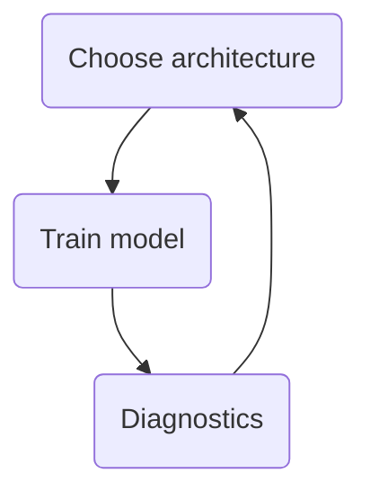

# Advanced Learning Algorithms

## Week 1

### Neurons and the Brain

#### Neural Networks

The human brain, or maybe more generally, the biological brain demonstrates a higher level or more capable level of intelligence and anything else would be on the bill so far. So neural networks has started with the motivation of trying to build software to mimic the brain. The first application area that modern neural networks or deep learning, had a huge impact on was probably speech recognition, where we started to see much better speech recognition systems due to modern deep learning. And then it started to make inroads into computer vision. Then the next few years, it made us inroads into texts or into natural language processing, and so on and so forth. Now, neural networks are used in everything from climate change to medical imaging to online advertising to products recommendations and really lots of application areas of machine learning now use neural networks. 

The artificial neural networks uses a very simplified mathematical model of what a biological neuron does. A **neuron** take some inputs and then does some computation and outputs some other number, which then could be an input to a second neuron. When you are building an artificial neural network or deep learning algorithm, rather than building one neuron at a time, you often want to simulate many such neurons at the same time. So there will be many neurons and they will collectively input a few numbers, carry out some computation, and output some other numbers. 

#### Why Now

In many application areas, the amount of digital data has exploded. And those traditional learning algorithm were not able to take effective advantage of more data we had for different applications. But if you were to train a small neural network on a dataset, then the performance is much better than traditional learning algorithms. And if you were to train a very large neural network, meaning one with a lot of these artificial neurons, then for some applications, the performance will keep on going up. If you are able to train a very large neural network to take advantage of that huge amount of data you have, then you could attain performance on anything, ranging from speech recognition to image recognition, to natural language processing applications and many more, they just were not possible with earlier generations of learning algorithms. This caused deep learning algorithms to taken off, and this too is why faster computer processes, including the rise of GPUs or graphics processer units. This is hardware originally designed to generate nice-looking computer graphics, but turned out to be really powerful for deep learning as well. That was also a major force in allowing deep learning algorithms to become what it is today. 

### Neural Network Model

#### Simple Neural Network

A simple three-layer neural network consists of an input layer, a hidden layer, and an output layer. The **input layer** receives the initial data, with each neuron representing a feature of this data. It then passes the data to the hidden layer, which performs core computations. Neurons in the **hidden layer** apply weights and biases to the inputs, process them through an activation function, and learn complex patterns. The **output layer** receives this processed information and generates the final output. The number of neurons in the output layer corresponds to the number of output classes or the type of prediction required. 

#### More Complex Neural Networks

A complex neural network always contains more than one hidden layer. To denote the multiple hidden layer, we use superscript $[i]$ to represent the $i\text{-th}$ layer of the network. And by convention, layer $0$ is the input layer and layer $n$ is the output layer. When we say that a neural network has $n$ layers, that includes all the hidden layers and the output layer, but we don't count the input layer. 

#### Forward Propagation

In the network, we propagating the activations of the neurons from the left to right. Starting from the input layer, each layer of neurons processes the input by applying weights, biases, and an activation function, and then passes the result to the next layer. This continues through the hidden layers until the output layer produces the final prediction or classification. Thus this is called forward propagation. 

With the neural networks inference using the forward propagation algorithm, we are able to download the parameters of a neural network that someone had trained to carry out inference on our new data using their neural network. 

### Other Activation Functions

#### Three Basic Activation Functions

Besides Sigmoid function, we have 2 other basic activation functions as well. 

- Linear Activation Function (No activation function)

  The expression is

$$
g(z) = z
$$

- **ReLU (Rectified Linear Unit)**

  The expression is

$$
g(z) = max(0, z)
$$

#### Choosing Activation Functions

Now we know that there are many activation functions are used in deep learning. But the **ReLU** activation function is by far the most common choice in how neural networks are trained in the hidden layer. 

Here are the reasons why people prefer ReLU activation function

- ReLU is a bit faster to compare because it just requires computing max of 0 and z, where sigmoid requires taking an exponentiation and then a inverse and so on. 
- ReLU function goes flat only in one part of the graph where the sigmoid activation function it goes flat in both left and right of the graph. So ReLU activation function will performance better in gradient descent and make out neural network to learn a bit faster as well.  

Therefore, for the output layer, we recommend **sigmoid activation function** for **binary classification**, **linear activation function** for **linear regression** and $y$ can take on positive or negative values, and **ReLU 0999778activation function** for **regression** and $y$ can take only non-negative values. And for the hidden layer, we recommend just using **ReLU** as a default activation function. 

**Notice: Do not use linear activations in hidden layers.**

### Multiclass Classification

A multiclass classification problem is still a classification problem in that $y$ can take on more than two possible values. But multiclass classification problem is still a classification problem in that $y$ can take on only a small number of discrete categories is not any number. 

#### Softmax

We have already know the expression of logistic regression. And **Softmax regression** is similar with logistic regression. For a softmax regression, we have
$$
z_j = \vec{w_j}\cdot\vec{x} + b_j,\ j = 1, 2, \cdots, n \\
a_j = \frac{e^{z_j}}{\sum_{k=1}^{n}e^{z_k}} = P(y = j|\vec{x}) \\
$$
Apparently, 
$$
\sum_{j=1}^{n}a_j = 1, \ j = 1, 2, \cdots, n \\
$$
The **loss function** is 
$$
loss(a_1, a_2, \cdots, a_n, y) =  
\begin{cases}
\begin{matrix}
-\log{a_1}\ \text{if}\ y = 1 \\
-\log{a_2}\ \text{if}\ y = 2 \\
\vdots \\
-\log{a_n}\ \text{if}\ y = n \\
\end{matrix}
\end{cases}
$$

#### Multi-label Classification

Sometimes we may encounter some problems that require us to classify more than one thing. We can choose multiclass classification or multi-label classification. For multiclass classification, there will be several neural networks and each of them has a output. For multi-label classification, it trains one neural network with several outputs, or we can say, a vector. 

### Advanced Optimization

In sometimes, traditional gradient descent algorithm may not perform very well. When every single step of gradient descent is pretty much going in the same direction, it means the learning rate is too small. When the steps of gradient descent is oscillating back and forth, it means the learning rate is too large. 

Therefore, we can use **Adam (Adaptive Moment Estimation) Algorithm** to help gradient descent perform better. This algorithm has a unique learning rate for each feature. So the gradient descent expressions are
$$
w_1 = w_1 - \alpha_1\frac{\partial}{\partial{w_1}}J(\vec{w}, b) \\
w_2 = w_2 - \alpha_2\frac{\partial}{\partial{w_2}}J(\vec{w}, b) \\
\vdots \\
b = b - \alpha_{n+1}\frac{\partial}{\partial{b}}J(\vec{w}, b) \\
$$
The solution of Adam algorithm is, if $w_j$ (or $b$) keeps moving in the same direction, then increase $\alpha_j$. And if $w_j$ (or $b$) keeps oscillating, then reduce $\alpha_j$. 

## Week 2 

### Machine learning Diagnostic

#### Evaluating a Model

 For a dataset, we can choose some of them to be a training set and the other to be a test set. $m_{train}$ and $m_{test}$ denote the size of training set and test set. 

**Test Error** refers to the discrepancy between the predicted values and the actual values on a separate test dataset, which the model hasn't seen during training. It assesses the model's ability to generalize to new data. 

**Training Error** refers to the discrepancy between the predicted values and the actual values on the training dataset. It reflects how well the model has learned the training data.

**Train/Test procedure for linear regression with squared error cost**

Fit parameters by minimizing cost function $J(\vec{w}, b)$
$$
J(\vec{w},b) = min_{\vec{w}, b}\left[\frac{1}{2m_{train}}\sum_{i=1}^{m_{train}}\left(f_{\vec{w},b}\left(\vec{x}^{(i)}\right) - y^{(i)}\right)^2 + \frac{\lambda}{2m_{train}}\sum_{j=1}^{n}w_j^2\right]
$$
The test error is 
$$
J_{test}(\vec{w},b) = \frac{1}{2m_{test}}\left[\sum_{i=1}^{m_{test}}\left(f_{\vec{w},b}\left(\vec{x}_{test}^{(i)}\right) - y_{test}^{(i)}\right)^2\right]
$$
The training error is 
$$
J_{train}(\vec{w},b) = \frac{1}{2m_{train}}\left[\sum_{i=1}^{m_{train}}\left(f_{\vec{w},b}\left(\vec{x}_{train}^{(i)}\right) - y_{train}^{(i)}\right)^2\right]
$$
**Train/Test procedure for classification problem**

Fit parameters by minimizing $J(\vec{w},b)$ to find $\vec{w}, b$
$$
J(\vec{w},b) = -\frac{1}{m}\sum_{i=1}^{m}\left[y^{(i)}\log\left(f_{\vec{w},b}(\vec{x}^{(i)})\right) + (1-y^{(i)})\log\left(1-f_{\vec{w},b}(\vec{x}^{(i)})\right)\right]
$$
The test error is 
$$
J_{test}(\vec{w},b) = -\frac{1}{m_{test}}\sum_{i=1}^{m_{test}}\left[y_{test}^{(i)}\log\left(f_{\vec{w},b}(\vec{x}_{test}^{(i)})\right) + (1-y_{test}^{(i)})\log\left(1-f_{\vec{w},b}(\vec{x}_{test}^{(i)})\right)\right]
$$
The train error is
$$
J_{train}(\vec{w},b) = -\frac{1}{m_{train}}\sum_{i=1}^{m_{train}}\left[y_{train}^{(i)}\log\left(f_{\vec{w},b}(\vec{x}_{train}^{(i)})\right) + (1-y_{train}^{(i)})\log\left(1-f_{\vec{w},b}(\vec{x}_{train}^{(i)})\right)\right]
$$
Fraction of the test set and the fraction of the train set that the algorithm has misclassified. $J_{test}(\vec{w}, b)$ is the fraction of the test set that has been misclassified and $J_{train}(\vec{w},b)$ is the fraction of the train set that has been misclassified. 

#### Model Selection

If we want to decide a model with some features, we can evaluate the model with different amounts of features and then find out the model which perform best. For a whole dataset, we can divide them into three parts: **training set, cross validation, and test set**. And this evaluating method is better than only use training set and test set. **Cross validation**, also called development set or dev set, is an extra dataset that we are going to use to check or trust check the validity or really the accuracy of different models. And the cross validation error is very similar to the training error and test error. For linear regression, the cross validation error is
$$
J_{cv}(\vec{w},b) = \frac{1}{2m_{cv}}\left[\sum_{i=1}^{m_{cv}}\left(f_{\vec{w},b}\left(\vec{x}_{cv}^{(i)}\right) - y_{cv}^{(i)}\right)^2\right]
$$

### Bias and Variance

Bias and variance are two fundamental concepts that describe the sources of error in machine learning models. **Bias** refers to the difference between training set and predicted results, and **variance** refers to the difference between cross validation and real dataset. 

#### Establishing a Baseline Level of Performance

Sometimes we may think that the performance of our model is not pretty well, such as $11\%$. But it is true? If we analysis the performance of human, we may find that the performance of human may be just $10\%$. So in this case, we can not say that our model performs not good. 

Therefore, it is important to establish a baseline level of performance and get a level of error we can reasonably hope to get to. We should consider the human level performance, and then compete algorithms performance, and finally guess based on experience. Once we get the predicted performance of model, we will then know if our model really performs not well. 

If the results of baseline performance and training error are similar, but the results of training error and cross validation error are quite different, it means the model has a high variance. If the results of training error and cross validation error are similar, but the results of baseline performance are quite different, it means the model has a high bias. If all these three have significant differences, it means the model has both high bias and high variance. 

#### Debugging a Learning Algorithm

If we encounter high bias or high variance in debugging a learning algorithm, how can we fix them? Here are some solutions using linear regression as example.

| Problem       | Solution                        |
| ------------- | ------------------------------- |
| High variance | Get more training examples      |
| High variance | Try smaller sets of features    |
| High variance | Try increasing $\lambda$        |
| High bias     | Try getting additional features |
| High bias     | Try adding polynomial features  |
| High bias     | Try decreasing $\lambda$        |

### Machine Learning System Design

#### Iterative Loop of ML Development

Generally, the iterative loop of ML development is like

#### Error Analysis

For a new machine learning problem, we should start with a simple algorithm. After we have the initial implementation, we use error analysis to see what errors have occurred, and then decide how to optimize it. This implementation is faster and more efficient than building a complex algorithm from the beginning

#### Data Augmentation

Data augmentation is a technique used to improve model performance by generating additional training data. It creates new data samples by applying **transformations** (such as rotation, cropping, flipping, scaling, adding noise, etc.) to the existing data. These transformations help the model better understand data diversity, reduce overfitting, and improve generalization when dealing with new data. Data augmentation is particularly common in computer vision but can also be applied in other fields, such as natural language processing and audio processing.

In many practical applications of machine learning, we often cannot obtain enough data samples, so we can **expand the number of samples** through data augmentation, so that limited data can produce value equivalent to more data.

#### Transfer Learning 

Transfer learning is the ability of a system to recognize and apply knowledge and skills learned in previous domains/tasks to novel domains/tasks.

Training a new machine learning model is a time-consuming and complex process that requires large amounts of data, computing power, and multiple iterations before it can be put into production. With transfer learning, organizations can use new data to retrain existing models for related tasks.

Therefore, transfer learning can improves the efficiency, accessibility and performance of a model. 

#### Full Cycle of a Machine Learning Project

We can divide the project into four parts as follows:

- Scope project: Define project
- Collect data: Define and collect data
- Train model: Training, error analysis & iterative improvement
- Deploy in production: Deploy, monitor and maintain system

### Skewed datasets

#### Error Metrics for Skewed Datasets

In machine learning, Precision and Recall are crucial metrics for evaluating the performance of classification models, especially when dealing with imbalanced datasets.

For a model prediction results, we have four classes. 

|         \          |  Actual Class: 1   |  Actual Class: 0   |
| :----------------: | :----------------: | :----------------: |
| Predicted Class: 1 | True Positive(TP)  | False Positive(FP) |
| Predicted Class: 0 | False Negative(FN) | True  Negative(TN) |

- Precision

Precision refers to the proportion of true positive predictions among all the instances that the model predicted as positive. It measures the accuracy of the positive predictions made by the model.
$$
Precision = \frac{True\ Positives(TP)}{True\ Positives(TP) + False\ Positives(FP)}
$$

- Recall

Recall refers to the proportion of true positive instances that were correctly identified by the model out of all the actual positive instances. It measures the model's ability to capture all the relevant positive cases.
$$
Recall = \frac{True\ Positives(TP)}{True\ Positives(TP) + False\ Negatives(FN)}
$$

#### Trading Off Precision and Recall

Generally, we will use 0.5 as the **threshold** for the model output value, thereby dividing the prediction results into two categories: true and false. If we want to get a higher precision and a lower recall, then we can use a threshold larger than 0.5. And if we want to get a lower precision and a higher recall, then we can use a threshold smaller than 0.5. 

A useful model usually requires both high precision and high recall. We can use $F_1$ score to measure the performance of the model. 
$$
F_1\ score = \frac{1}{\frac{1}{2}\left(\frac{1}{P}+\frac{1}{R}\right)} = \frac{2PR}{P+R}
$$
The larger the value of $F_1$, the precision and recall of the model are approximately balanced.

We can also draw a precision-recall diagram and choose a suitable threshold for the model.

## Week 3

### Decision Trees

#### Decision Tree Model

A decision tree is a supervised learning algorithm used for both classification and regression tasks. It works by **splitting the data into subsets based on feature values**, creating a tree-like structure where each internal node represents a feature attribute, each branch represents a possible value of that feature, and each leaf node represents a final decision or prediction.

The process of building a decision tree involves selecting the best feature to split the data at each step to reduce uncertainty , and then recursively constructing subtrees for the resulting subsets until certain stopping criteria are met.
#### Learning Process

When building a decision tree, we should maximize the purity(or minimize the impurity) to choose what feature to split on at each node. This means that the samples in each subset either belong to the same category as much as possible, or their target values are as similar as possible.

To build a useful model, we also need to limit the depth of the tree, or it may cause the overfitting. Here are some situations that we need to stop splitting. 

- When a node is 100% one class

- When splitting a node will result in the tree exceeding a maximum depth

- When improvements in purity score are below a threshold

- When number of examples in a node is below a threshold

#### Measuring Purity

Entropy is a measure of the impurity of a set of data. Let 
$$
p_1 = \text{fraction of examples that are cats} \\
p_0 = 1 - p_1
$$
Then the extropy function is
$$
\begin{aligned}
H(p_1) &= -p_1\log_2(p_1) - p_0\log_2(p_0) \\
&= -p_1\log_2(p_1) - (1-p_1)\log_2(1-p_1) \\
\end{aligned}
$$
Specially, we define $0\log(0)=0$.

#### Choosing a Split

For a node in decision tree, we use

- $p_1^{root}$ as the proportion of target in root node samples
- $p_1^{left}$ as the proportion of target in left child node samples
- $p_1^{right}$ as the proportion of target in right child node samples
- $w^{left}$ as the proportion of left child node samples in root node samples
- $w^{right}$ as the proportion of right child node samples in root node samples

And the **information gain** is
$$
H(p_1^{root}) - \left(w^{left}H(p_1^{left}) + w^{right}H(p_1^{right})\right)
$$
The greater the information gain, the more suitable it is as a splitting feature in the decision tree.

#### Splitting on a Continuous Variable

For a continuous variable, we need to sort the values, then calculate information gain for each potential split point and select the best split point. The best split point has the maximum information gain.

### Tree Ensemble

One of the weaknesses of using a single decision tree is that decision tree can be highly sensitive to small changes in the data. We can build a lot of decision trees and we called that a tree ensemble. 

When we use a large number of decision trees and have them vote, our overall algorithm becomes **less sensitive** to the behavior of any single tree, as each tree contributes only one vote among many. This collective voting process enhances the robustness of the entire algorithm.

#### Sampling with Replacement

Sampling with replacement is a method where each time you select a sample from a dataset, you return it back to the dataset before the next draw. This means **the same sample can be selected multiple times** during the sampling process. Each draw is independent, and every sample has an equal chance of being selected in every draw.

The process of sampling with replacement lets us construct a new training set. That's a bit similar to but also pretty different from our original training set. It turns out that this would be the key building block for building an ensemble of trees. 

#### Random Forest Algorithm

The Random Forest algorithm is an ensemble learning method that builds multiple decision trees to perform classification or regression. Each tree is trained on a random subset of the original dataset, and at each node, only a randomly selected subset of features is considered for splitting. The final prediction is made by aggregating the results of all the trees, either through majority voting or averaging.

We usually choose the size of forest between $64$ and $128$. At each node, when choosing a feature to use to split, if $n$ features are available, pick a random subset of $k < n$ features and allow the algorithm to only choose from that subset of features. A typical choice for the value of $k$ would be to choose it to be square root of $n\ (k = \sqrt{n})$. 

#### XGBoost

XGBoost (Extreme Gradient Boosting) is an efficient and flexible machine learning algorithm that is part of the **gradient boosting framework**. It builds a series of decision trees iteratively, with each new tree improving the model's performance by **minimizing a loss function** based on the previous trees.

It is widely popular in data competitions and real-world applications, particularly for large-scale datasets and complex problems. It is commonly used for tasks such as classification, regression, and ranking, and has been highly successful in Kaggle competitions.

#### When to Use Decision Trees

**Decision Trees and Tree ensembles**

- Works well on tabular (structured) data
- Not recommended for unstructured data (images, audio, text)
- Fast
- Small decision trees may be human interpretable

**Neural Networks**

- Works well on all types of data, including tabular (structured) and unstructured data
- May be slower than a decision tree
- Works with transfer learning
- When building a system of multiple models working together, it might be easier to string together multiple neural networks
